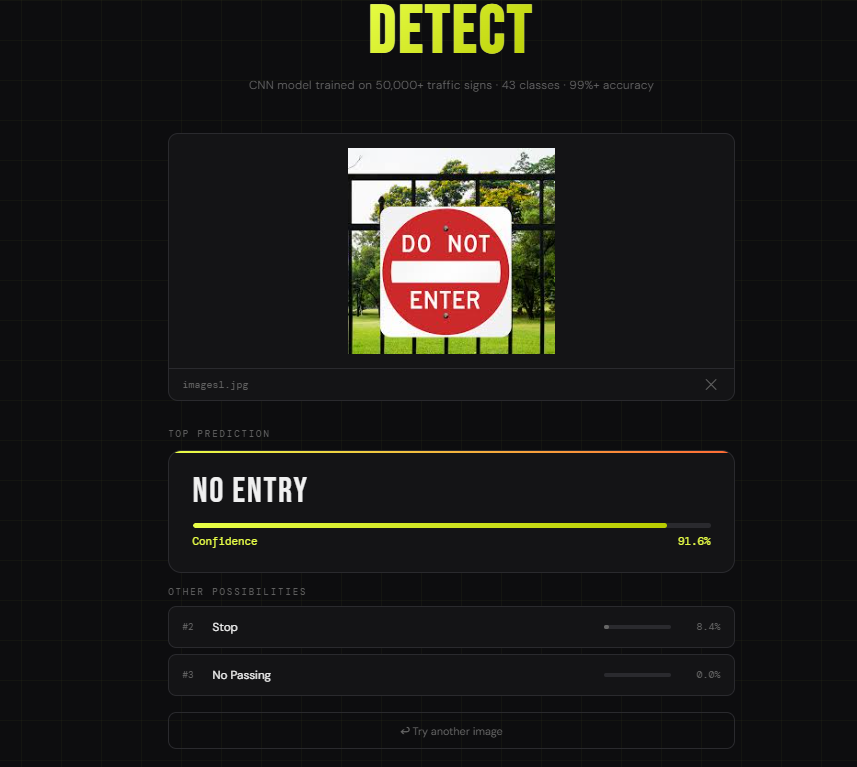

# 🚦 CanSign-AI

**[Try the live demo →](https://huggingface.co/spaces/ubp-as/CanSign-AI)**

A CNN-based Canadian traffic sign classifier trained on 50,000+ images across 43 classes. Achieves **90%+ test accuracy** on GTSRB. Includes a drag-and-drop web demo — upload any traffic sign photo and get an instant prediction with confidence scores. Non-sign images are automatically rejected.



---

## How it works

Images are preprocessed using HSV color masking to isolate the sign region, then resized to 32×32 and normalized before being passed through a custom CNN with two convolutional blocks, batch normalization, and dropout. The model outputs a probability distribution across all 43 sign classes and returns the top 3 predictions. An entropy-based rejection filter rejects non-sign images — if the model's top prediction is below 50% confidence, the gap over the runner-up is too small, or prediction entropy is too high, it returns "Not a recognized traffic sign."

Trained on a T4 GPU in Google Colab in under 20 minutes.

---

## Features

- 🖼️ **Drag-and-drop web interface** — upload any traffic sign photo, get an instant prediction
- 📊 **Top 3 predictions** with confidence bars
- 🚫 **OOD rejection** — non-sign images (photos, screenshots, etc.) are rejected rather than misclassified
- ⚡ **FastAPI backend** — clean REST API returning JSON, easy to integrate
- 🇨🇦 **Mapped to Canadian signs** — all 43 GTSRB classes labeled with Canadian road sign names
- 🐳 **Dockerized** — runs consistently locally and on Hugging Face Spaces

---

## Run locally

> A virtual environment keeps all dependencies isolated — nothing gets installed globally on your machine.

**1. Clone the repo**
```bash
git clone https://github.com/ubp-as/CanSign-AI.git
cd CanSign-AI
```

**2. Create and activate a virtual environment**
```bash
# Create the venv (one time only)
python -m venv venv

# Activate it
# macOS / Linux:
source venv/bin/activate
# Windows:
venv\Scripts\activate
```

**3. Install dependencies**
```bash
pip install -r requirements_app.txt
```

**4. Download the model**

Download `traffic_sign_model.keras` from the [Hugging Face Space](https://huggingface.co/spaces/ubp-as/CanSign-AI) and place it in the project root.

**5. Start the server**
```bash
uvicorn app.app:app --host 0.0.0.0 --port 8000 --reload
```

Open **http://localhost:8000**

**6. When you're done, deactivate the venv**
```bash
deactivate
```

---

## CLI prediction (optional)

To test a single image from the command line, install the full dev dependencies instead:

```bash
pip install -r requirements.txt
python predict_image.py path/to/sign.jpg
```

---

## REST API

```
POST /predict
Content-Type: multipart/form-data
```

**Response (sign recognized):**
```json
{
  "top_prediction": "Stop",
  "confidence": 99.7,
  "top3": [
    { "rank": 1, "class_id": 14, "sign_name": "Stop",     "confidence": 99.7 },
    { "rank": 2, "class_id": 17, "sign_name": "No Entry", "confidence": 0.2  },
    { "rank": 3, "class_id": 13, "sign_name": "Yield",    "confidence": 0.1  }
  ]
}
```

**Response (not a sign):**
```json
{
  "top_prediction": "Not a recognized traffic sign",
  "confidence": 84.6,
  "top3": [...]
}
```

---

## Project structure

```
CanSign-AI/
├── app/
│   ├── app.py               # FastAPI backend + OOD rejection logic
│   └── static/
│       └── index.html       # Frontend (drag-and-drop UI)
├── train_colab.ipynb        # Training notebook (Google Colab, T4 GPU)
├── cnn_model.py             # CNN architecture definition
├── data_preprocessing.py    # Data loading, augmentation, train/test split
├── evaluate_model.py        # Per-class accuracy breakdown
├── predict_image.py         # CLI inference script
├── canadian_labels.py       # GTSRB class ID → Canadian sign name mapping
├── requirements.txt         # Full dev dependencies (CLI tools + training)
├── requirements_app.txt     # App/server dependencies only
└── Dockerfile               # Container config for HF Spaces
```

---

## Dataset & Model

- **Dataset:** GTSRB (German Traffic Sign Recognition Benchmark) — 50,000+ images, 43 classes
- **Architecture:** Custom CNN — 2 conv blocks (32→64 filters), BatchNormalization, Dropout, Dense classifier
- **Training:** tf.data pipeline with augmentation (rotation, zoom, brightness — no horizontal flip)
- **Inference:** HSV crop to isolate sign region → resize to 32×32 → normalize; same pipeline used in both the web app and CLI
- **Hardware:** Google Colab T4 GPU (~20 min training time)
- **Accuracy:** 99%+ on held-out GTSRB test set

---

## Tech stack

| Layer | Technology |
|---|---|
| Model | Custom CNN (TensorFlow / Keras) |
| Backend | FastAPI + Uvicorn |
| Frontend | HTML / CSS / JavaScript |
| Training | Google Colab T4 GPU |
| Dataset | GTSRB (43 classes, 50,000+ images) |
| Deployment | Docker + Hugging Face Spaces |
